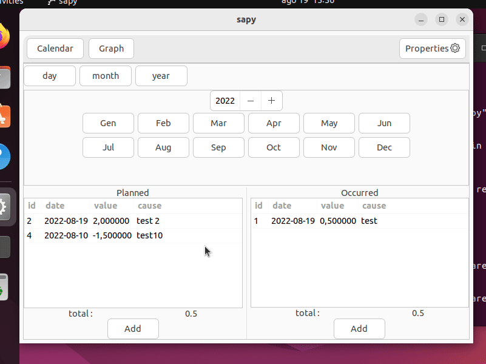
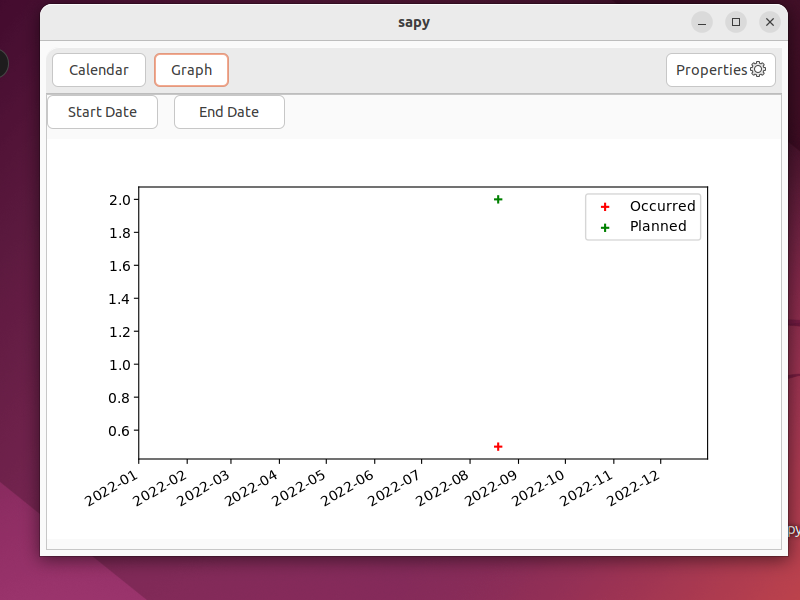
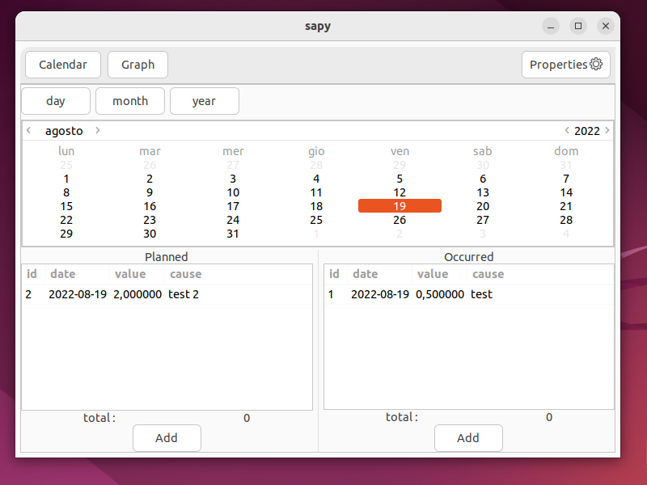
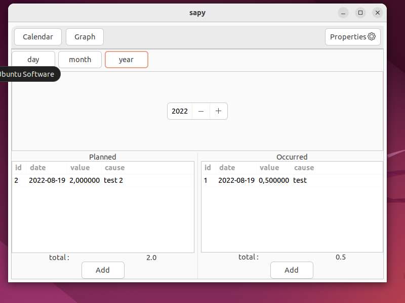
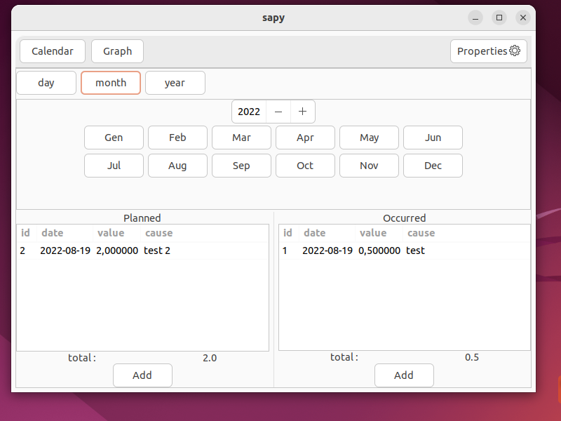

---
# Feel free to add content and custom Front Matter to this file.
# To modify the layout, see https://jekyllrb.com/docs/themes/#overriding-theme-defaults

layout: home
---



The purpose of this softeware is to allow a quick view of your personal budget.
The idea behind this software is implement an interface for the Japanese Kakeibo method.
The word "kakeibo" can be translated as Household ledger and is literally meant
for household financial management. Kakeibos vary in structure, but the basic
idea is the same. At the beginning of the month, the kakeibo writes down the
income and necessary expenses for the beginning month and decides some kind of
savings target. The user then records their own expenses on a daily basis, which
are added together first at the end of the week and later at the end of the month.
At the end of the month, a summary of the month's spending is written in kakeibo.
In addition to expenses and income, thoughts and observations are written in kakeibo
with the aim of raising awareness of one's own consumption.

* [references](https://en.wikipedia.org/wiki/Kakeibo)

The code is available on [github](https://github.com/stethewwolf/Sapy/tree/devel)

Important acronyms:

* mom : movement of money, it used to represent an  money income or outcome and it is described using date, value and cause
* lom : list of movements, a bunch of moms

## Development

Install the libgirepository dev pkg in order to install requirements into the virtualenv

```
    $ sudo apt install libgirepository1.0-dev
```

You can follow those steps:

```
    $ git clone https://github.com/stethewwolf/Sapy.git         # get the code
    $ cd Sapy                                                                          # enter the code volder
    $ virtualenv venv                                                              # create the virtualenv
    $ source venv/bin/activate                                                # load the virtualenv
    $ pip install -r requirements                                              # install requirements into the venv
    $ python setup.py install                                                   # install sapy into the venv
    $ export  SAPY_HOME=~/.sapy-test                                  # set custom app folder 
    $ sapy --gui                                                                        # start the app
```

To generare the documentation you need to install the doc generator:

```pip install mkdocs mkdocs-windmill```

and run:
```mkdock build``` 

or:

```mkdock serve``` 

## Installation
### Manual Installation
#### Dependencies
##### Debian/Ubuntu
```
    $ sudo apt install python3-matplotlib libgirepository1.0-dev
```

##### Archlinux
```
    $ sudo pacman -S python-matplotlib python-cairo
```

#### Procedure

You can install sapy application using the following method

* download the code
* open the console inside the source folder
* run the `install.sh` script
* optionally: delete the source code folder

## Usage

The user can run the application in two way:
* using the command line
* using a gtk ui

### Command Line

Application Usage :

        sapy -h
        usage: Sapy [-h] [--add ADD] [--graph] [--gui] [--import IMPORT] [--list LIST] [--rm RM] [--version] [--balance] [--daily]
                    [--end-date END_DATE] [--id ID] [--monthly] [--lom LOM] [--start-date START_DATE] [--value VALUE] [--weekly]
                    [--cause CAUSE] [--date DATE] [--name NAME] [--new-year] [--new-month] [--end-week] [--end-month]

        A spending traking tool

        optional arguments:
        -h, --help            show this help message and exit
        --add ADD, -a ADD     add new item, takes : mom | lom | obj | tag
        --graph, -g           print the graph
        --gui                 run the application in grafical mode
        --import IMPORT, -i IMPORT
                                import data from csv file
        --list LIST, -l LIST  list things, target lom | mom | tag | obj
        --rm RM, -r RM        remove target : lom | mom | tag | obj
        --version, -V         print the version
        --balance, -b         print the actual balance of the list
        --daily, -D           set daily occurance
        --end-date END_DATE   set end date
        --id ID               specify id for operation
        --monthly             set monthly occurrance
        --lom LOM             specify the list of money ( lom )
        --start-date START_DATE
                                set start date
        --value VALUE, -v VALUE
                                set value
        --weekly              set weekly occurrance
        --cause CAUSE, -c CAUSE
                                set cause
        --date DATE, -d DATE  set the date for the operation
        --name NAME           set the name
        --new-year            start a new year
        --new-month           start a new month
        --end-week            ends the week, and insert real movement
        --end-month           ends the month


### User interface
The use interface is implemented using [glade](https://glade.gnome.org/) and [pygtk](https://pygobject.readthedocs.io/en/latest/).

It is composed by one window, splitted in two panels.

#### LOMS
In this panel user can add/remove or modify moms.

#### Graph

Here you can see the graphical rapresentation.

#### Gallery














## Notes
### CSV File Format

The CSV file you are importing must have following columns

    * date (dd.mm.yyyy),
    * cause,
    * value,

the delimiter for decimal values is the char '.'

the file must not include the header line at the beginning
